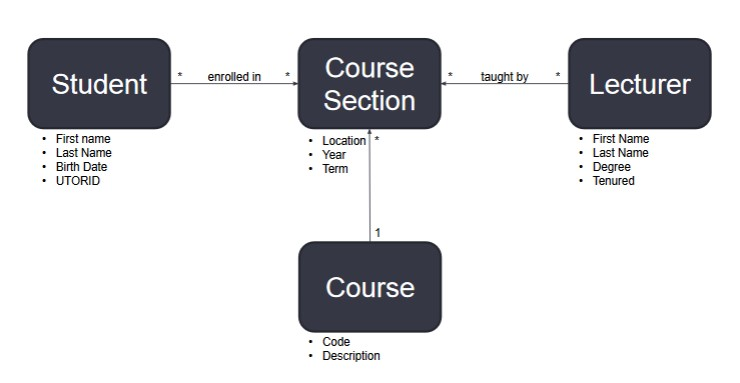
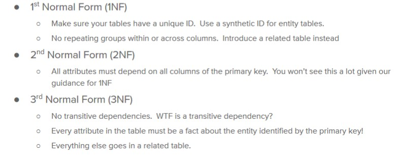
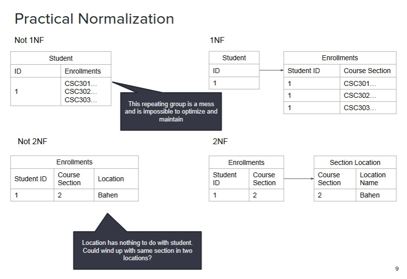
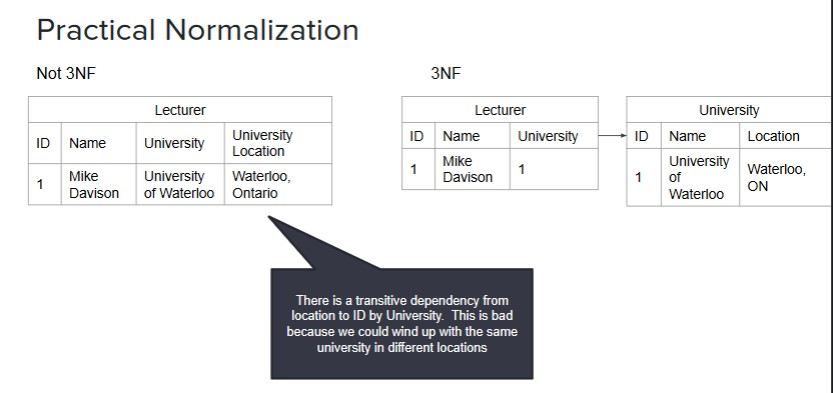
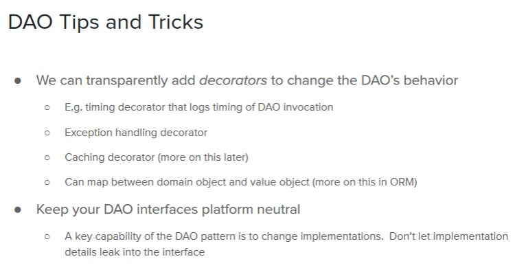
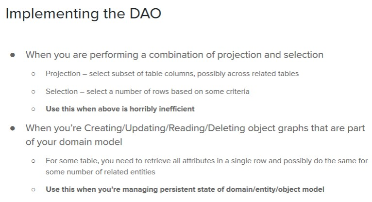
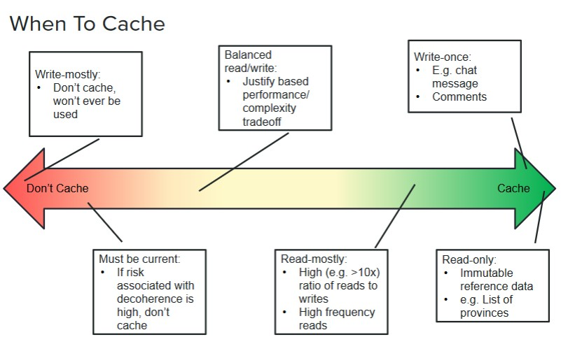
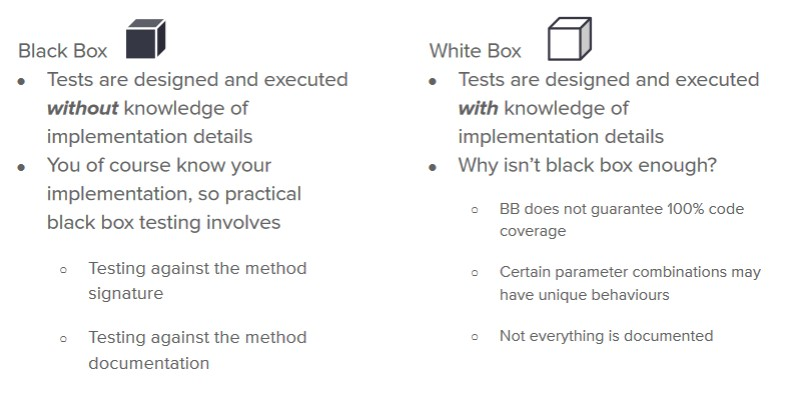

# TABLE OF CONTENTS

- [TABLE OF CONTENTS](#table-of-contents)
  - [Version Control - GIT](#version-control---git)
    - [Why do version control ?](#why-do-version-control)
    - [How GIT works?](#how-git-works)
    - [How to branch + merge](#how-to-branch--merge)
      - [Merging](#merging)
    - [Why to branch + merge](#why-to-branch--merge)
    - [Different areas or locations in a local Git repo](#different-areas-or-locations-in-a-local-git-repo)
    - [Words](#words)
  - [REST + WebAPI](#rest--webapi)
    - [REST](#rest)
      - [Design tips](#design-tips)
      - [HTTP Status codes](#http-status-codes)
  - [Agile Methodologies](#agile-methodologies)
    - [Waterfall](#waterfall)
    - [XP](#xp)
    - [Scrum](#scrum)
  - [Release management workflow](#release-management-workflow)
    - [Continuous Integration](#continuous-integration)
    - [Continous Delivery](#continous-delivery)
    - [Continous Deployment](#continous-deployment)
  - [DATA](#data)
    - [Conceptual Data Model (CDM)](#conceptual-data-model-cdm)
    - [Logical Data Model (LDM)](#logical-data-model-ldm)
    - [Practical Normalization](#practical-normalization)
    - [Data Access Object (DAO)](#data-access-object-dao)
    - [Cacheing](#cacheing)
  - [SQL](#sql)
  - [Unit Tests](#unit-tests)
    - [Types of Unit Tests](#types-of-unit-tests)

## Version Control - GIT

### Why do version control ?

- Modern systems are too large for one person to build
- Help with coordinating many tasks.
- Keep up-to-date
- Allow maintaining multiple versions of the same codebase
- Can be local, offline

### How GIT works?

- Organize a set of files
- Record changes: `commits`
- No single "Official" repo
- Can be cloned by any user
  - Everyone has complete history of the repo
- Every commit is a snapshot of the filesystem

### How to branch + merge

- `git branch <name>`: creating new branch of the current branch.
- `git checkout <name>`: move (checkout) to a `<name>` branch
- `git checkout -b <name>`: create + checkout.

#### Merging

- `Fast Forward`:
  - Changes only happened in one branch, since the branching point
  - Git simply move master to the merging branch.
- `Recursive merge`:
  - Branches have diverged from a common ancestor
  - changes in the two branches are `NOT` conflicting.
  - Merge performed by creating a new commit that has both changes.
    
- `Conflicting merge`:
  - Changes in the two branches are `conflicting`
  - Auto-merge not possible. Have to resolve conflict by hand.

### Why to branch + merge

- `Branch`: is just a reference to a commit in the graph. NOT another commit

### Different areas or locations in a local Git repo

- `Working directory`: the actual files on the machine
- `Staging Area`: (aka index) Intermediate storage for code changes
- `Repository`: (aka history) the graph of commits
  - `Local`: on machine
  - `remote`: on service (github,...)

### Words

- `git pull` == (sort of) does a `git fetch` followed by a `git merge`
- `git stash`: when you want to switch branches but not commit work on current branch.
  - Bring back stashed with `git stash apply/pop`

---

## REST + WebAPI

- `Application Programming Interface`: an interface or communication protocol between a client and a server intended to simplify the building of client-side software.

### REST

- `Representational State Transfer`:
  - Constraints:
    - Client-server
    - Stateless
      - no HTTP sessions
    - Cacheable
      - Reuse resources.
    - Layered
- [The Richardson Maturity Model](https://martinfowler.com/articles/richardsonMaturityModel.html): REST design process.
  - If you remember nothing else, remember this!

#### Design tips

- Support pagination and sorting in collection resources.
  - Query string params (`?p1=v1&p2=v2`)
  - URL path for everything else
- Content types
- HTTP status codes
- dont change state with GET

#### HTTP Status codes

- `200`: OK
- `201`: a resource was created
- `301`: Redirect. Need to use this when change URLs to a resource
- `400`: invalid syntax
- `401`: Unauthorized - missing authn headers
- `403`: Forbidden - valid & authenticated but missing permissions
- `404`: whatever you're looking for is not here
- `500`: something went horribly wrong.

## Agile Methodologies

### Waterfall

- Full project is divided into a sequence of sequential phases. This spans multiple years
- Pros:
  - Early discovery of bugs <= Long time spent on Requirements and Design
  - Good for microprocessor manufacturers.
- Cons:
  - Not suitable for changing requirements
  - User only sees the product at the end.

### XP

- Open workspace, customer always available, team meet daily.
- Daily "stand-ups"
- Pair Programming

### Scrum

- `Empirical`: Make predictions based on past experience
- `Product Owner`: Focused on value to users + stakeholders
  - `Stakeholders`: customers, partners, CEO
  - Responsible for success of product.
  - Set `Goals & Priorities`
- `Scrum Master`: Facilitator, ensures that everything is running smoothly.
- `Dev Team`: Traditionally 3-9 people
  - Decides what can get done.

## Release management workflow

### Continuous Integration

- Whenever code is submitted to git:
  - Build
  - run unit tests
  - Reject commit if unit tests fail

### Continous Delivery

- Continuous Integration `PLUS`

  - Deploy to Test infratructure
  - Run integration & UI tests
  - If tests pass, notify team that a build candidate is ready for production
  - When Release manager is satisfied, release code and infrastructure changes to production

### Continous Deployment

- Continous Delivery, `MINUS`:
  - Manual verification or production gatekeeping.

## DATA

### Conceptual Data Model (CDM)

- The entities whose state must be persisted
- Key attributes of entities (optional)
- Relationships between entities (1:1, 1:many, many:many)

### Logical Data Model (LDM)

- Platform indep, `normalized` data model.
  - Each fact is represented in the data model exactly once.
- Comprised of tables

### Practical Normalization

### Data Access Object (DAO)

- Define data-access methods in an interface
- Implement the DAO interface for different data stores
- Code is written against the interface, without knowing/caring about the underlying data.
- `DAO` is a design pattern for `abtracting the details` of an underlying data store.
  - `Not responsible` for persisting data.
  - `Does not` depend on a specific data store.
  - Methods use `DOMAIN LANGUAGE`

### Cacheing

## SQL

## Unit Tests

- Testing one single (and small) unit of code.
- Run fast.
- Large number of tests.
- Test different ways a unit of code may be used.

### Types of Unit Tests

