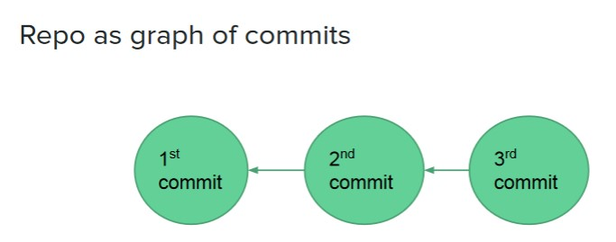
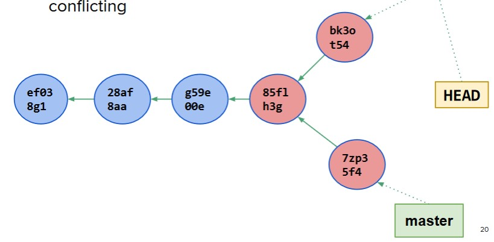

# TABLE OF CONTENTS

- [TABLE OF CONTENTS](#table-of-contents)
- [Version Control - GIT](#version-control---git)
  - [Why do version control ?](#why-do-version-control)
  - [How GIT works?](#how-git-works)
  - [How to branch + merge](#how-to-branch--merge)
    - [Merging](#merging)
  - [Why to branch + merge](#why-to-branch--merge)
  - [Different areas or locations in a local Git repo](#different-areas-or-locations-in-a-local-git-repo)
  - [Words](#words)
- [REST + WebAPI](#rest--webapi)
  - [REST](#rest)
    - [Design tips](#design-tips)
    - [HTTP Status codes](#http-status-codes)

# Version Control - GIT

## Why do version control ?

- Modern systems are too large for one person to build
- Help with coordinating many tasks.
- Keep up-to-date
- Allow maintaining multiple versions of the same codebase
- Can be local, offline

## How GIT works?

- Organize a set of files
- Record changes: `commits`
- No single "Official" repo
- Can be cloned by any user
  - Everyone has complete history of the repo
- Every commit is a snapshot of the filesystem

## How to branch + merge

- `git branch <name>`: creating new branch of the current branch.
- `git checkout <name>`: move (checkout) to a `<name>` branch
- `git checkout -b <name>`: create + checkout.

### Merging

- `Fast Forward`:
  - Changes only happened in one branch, since the branching point
  - Git simply move master to the merging branch.
- `Recursive merge`:
  - Branches have diverged from a common ancestor
  - changes in the two branches are `NOT` conflicting.
  - Merge performed by creating a new commit that has both changes.
    
- `Conflicting merge`:
  - Changes in the two branches are `conflicting`
  - Auto-merge not possible. Have to resolve conflict by hand.

## Why to branch + merge

- `Branch`: is just a reference to a commit in the graph. NOT another commit

## Different areas or locations in a local Git repo

- `Working directory`: the actual files on the machine
- `Staging Area`: (aka index) Intermediate storage for code changes
- `Repository`: (aka history) the graph of commits
  - `Local`: on machine
  - `remote`: on service (github,...)

## Words

- `git pull` == (sort of) does a `git fetch` followed by a `git merge`
- `git stash`: when you want to switch branches but not commit work on current branch.
  - Bring back stashed with `git stash apply/pop`

---

# REST + WebAPI

- `Application Programming Interface`: an interface or communication protocol between a client and a server intended to simplify the building of client-side software.

## REST

- `Representational State Transfer`:
  - Constraints:
    - Client-server
    - Stateless
      - no HTTP sessions
    - Cacheable
      - Reuse resources.
    - Layered
- [The Richardson Maturity Model](https://martinfowler.com/articles/richardsonMaturityModel.html): REST design process.
  - If you remember nothing else, remember this!

### Design tips

- Support pagination and sorting in collection resources.
  - Query string params (`?p1=v1&p2=v2`)
  - URL path for everything else
- Content types
- HTTP status codes
- dont change state with GET

### HTTP Status codes

- `200`: OK
- `201`: a resource was created
- `301`: Redirect. Need to use this when change URLs to a resource
- `400`: invalid syntax
- `401`: Unauthorized - missing authn headers
- `403`: Forbidden - valid & authenticated but missing permissions
- `404`: whatever you're looking for is not here
- `500`: something went horribly wrong.
